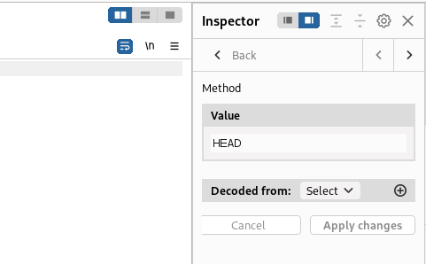

**Challenge Stonks - Binary Exploitation**

The Stonks challenge is what I will just call a stocks prediction algorithm written in C language. The algorithm has an API key which is used to determine the share and the stocks that a user possesses.

We are given a C program called vuln.c

When you start the challenge using the server connect command, it launches the vuln.c code with a menu. After analyzing the code, you will easily guess that the first option is not really useful since it ends the program execution. 

I try to enter an arbitrary value for the token asked and I see that it returns a set of characters, but after crafting it together, I discovered that it doesn’t really mean something in terms of any possible encoding. 

When you read the vuln code again, you will find out in the function encrypt that there is a piece of the code that is used to read the content of an API key. There I went back to read the hint on the challenge and I found out that it suggested reading an API Key. I then used a friend of mine to understand the meaning of a command that reads my entry for the API Key.

*The scanf() function reads to 300 characters*

I figure out that when you enter enough hexadecimal format entries to the scanf function, it sizes will causes a buffer overflow error due to the allocation of space that is made on the storage table of the normal 300 characters entry.

This buffer overflow will then lead the program to read and screen the FLAG\_BUFFER file.

The output is a hexadecimal cypher text.

I then used Magic (Cyberchef) to decrypt the ciphertext.

The output is in a reverse format with a little checking on the format. You will find this useful code to rearrange it.

for x in range (0, len(s), 4):

print (s[x+3]+s[x+2]+s[x+1]+s[x], end=’ ’)

And then, you find the flag.

*Wrapped with the last accolade, you obtain the complete flag.*

There you have the flag. Congratulations !!

**Get aHead - Web Exploitation**

This challenge redirects you to a website with two entry queries to change the color of the media page. With a form, the easiest thing will have been an inspection of the form and to check vulnerability to SQL injection.  But there was not any form on the page, so I just try to change the color that I was able to obtain by manipulating the query.  But solving ctf challenges are sometimes observation mind needs. So if you remark it the title of the challenge is GET aHead. HEAD is an HTTP method as well as GET and POST.  It gives you the content of the header response. 

I then started Burpsuite to capture and try to modify the protocol of the request when trying to submit the request to change the color.

Once it is done you forward the request if it is successful (200 Status), you will find the clear text flag in the response widget.

Challenge solved !!
